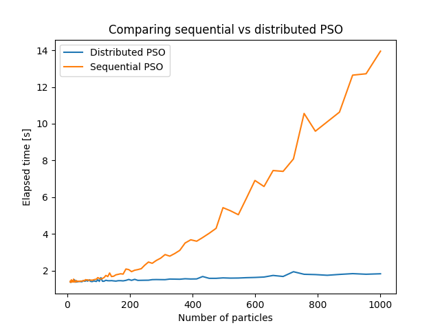

# ErlPSO
A Distributed particle swarm optimization (PSO) implementation in erlang.
Authors: Nicolas D. Mevlüt T.

---

This project aims to implement a high performance, distributed particle swarm optimizer. Developed during the CDC18 course. For a short description on particle swarm algorithms, I recommend you take a look at

[Particle swarm optimization](https://en.wikipedia.org/wiki/Particle_swarm_optimization)

## Project structure

The distributed PSO implementation can be found in

`src/pso.erl`

The sequential PSO implementation can be found in

`src/pso_seq.erl`

## Quickstart

To use the optimizer, you need to do the following

1. Customize the cost function

Modify the function `cost_function` in `pso.erl`. 

2. Call `pso:start(N, W_s, W_c, Phi, Dim, Lo, Hi, Epochs)`, where

| Parameter name | Meaning | Recommended testing values |
|:--------------:|---------|----------------------------|
|`N`             | Number of particles | 10-100 |
|`W_s`           | Social weight. Determines how much particles are attracted to the global minimum. | 1-2 |
| `W_c`          | Cognitive weight. Determines how much particles are attracted to the local minimum. | 1-2 |
| `Phi`          | Inertia of the particles | (0,1] |
| `Epochs`       | Number of epochs | 100-1000 |

---

## Why use a distributed PSO ? 

If the particle swarm algorithm is used with a high amount of particles, then distributing the particles on different erlang nodes results in a massive performance boost, as can be seen in the following plot:

Both version where started with following parameters (Variable number of particles):

`W_s = 2`

`w_c = 2`

`Phi = 0.75`

`Dim = 2`

`Lo = -5`

`Hi = 5`

`Epochs = 200`

The function used to test the PSO implementation is [Himmelblau's function](https://en.m.wikipedia.org/wiki/Himmelblau%27s_function):

From
http://infinity77.net/global_optimization/_images/HimmelBlau.png
https://upload.wikimedia.org/wikipedia/commons/d/d8/Log_LC_Himmelblau_Function.PNG
